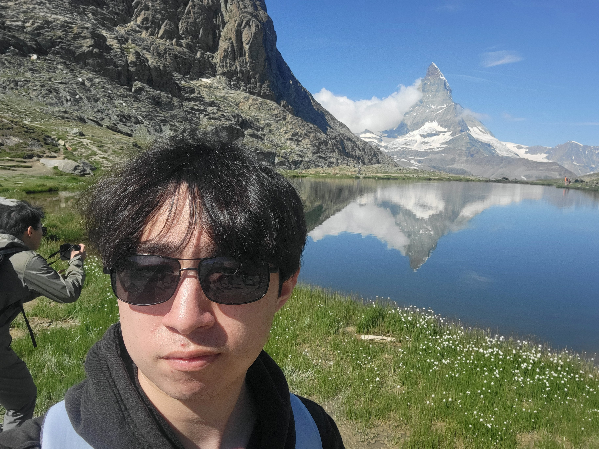

# About Me - Darwin Smith



## Table of Contents
1. [Introduction](#introduction)
2. [Programming Background](#programming-background)
3. [Personal Life](#personal-life)
4. [Fun Facts](#fun-facts)
5. [Links](#links)

---

## Introduction
> "lil awkward, but social, and always down to learn something new."

Hey there! I'm a student in this Software Engineering class, and this page is a little about me — both as a programmer and just as a person.

---

## Programming Background

### How I Got Into Coding
I started coding pretty early on in high school, mostly because it was fun to mess around and take community college courses with friends.

> *"Learning to code made me feel so cool at that age."*

### Languages I've Used
Here’s a quick rundown of my experience so far:

- Python (Lots of experience)
- Java (Good amount)
- C (Decent experience)
- JavaScript / HTML / CSS (Erm)

#### Some sample Python code I wrote early on:
```python
print("Hello world!")
```

## What I'm Excited About

This class is my first real dive into web development! Even though I’ve barely touched JavaScript, HTML, or CSS before, I’m feeling pretty confident that I’ll be able to navigate things intuitively. I'm especially excited because web development seems super useful, both for fun projects and for future work.

Things I’m looking forward to:

- [x] Learning how websites actually work under the hood
- [x] Building cool-looking projects
- [x] Collaborating with a team
- [ ] Not breaking the CSS every 5 minutes :)

---

## Personal Life

Outside of coding, I’m a pretty big gamer. I love getting lost in games with friends — but I’m also a huge fan of nature and being outdoors.

One of my favorite hobbies lately has been climbing. I recently went on a big climbing trip to Joshua Tree, which was wild because I’m still super scared of heights. Climbing has been a cool way for me to push through that fear.

Other things I’m into:

- Gaming
- Climbing
- Backpacking / Wilderness Adventures
- Hanging out with homies

---

## Fun Facts

> *"Scared of heights but loves climbing — makes sense."*

- I started coding early in high school with friends just for fun.
- I love both chill gaming nights and crazy outdoor adventures.
- Definitely hoping for good team synergy in this class!

---

## Links

- [My Favorite Game Website](https://terraria.org/)
- [What got me into Climbing a Few Years Ago](https://www.youtube.com/@magmidt)
- [A Picture from Joshua Tree](INSERT_IMAGE_LINK_HERE)
